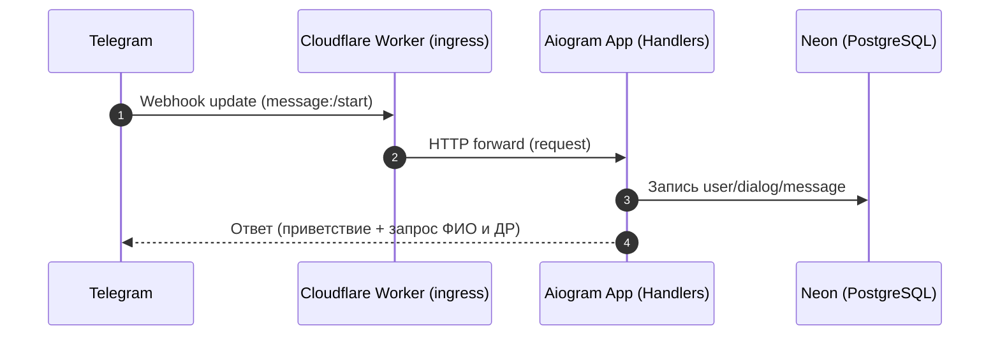
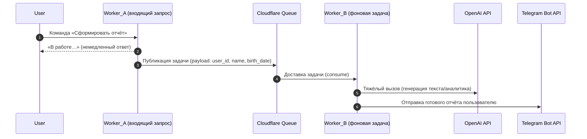
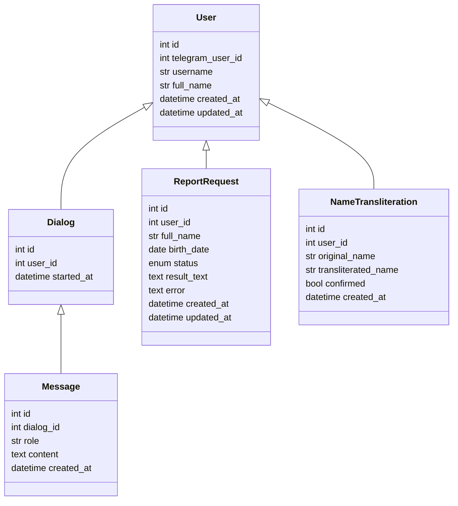

# Архитектура MVP AI-ассистента «Аналитик» (Serverless на Cloudflare)

Документ описывает архитектуру, ключевые компоненты, паттерны интеграции и формат итогового отчёта. Стиль общения и интерпретации соответствует «Книге Знаний по Цифрологии» (система Миланы Тарба).

- Язык реализации: Python 3.11+, Aiogram 3.x
- Платформа: Cloudflare Workers (серверлесс, секреты, KV, Queues, R2)
- БД: Neon (PostgreSQL, serverless)
- Хранилище: Cloudflare R2 (медиа/отчёты при необходимости)
- Кэш/метаданные: Cloudflare KV
 - AI: OpenAI API (GPT-4.1)

Кодовая структура (см. каталоги в `src/`):
- `src/handlers/` — хендлеры Aiogram
- `src/middlewares/` — DI и прочие middleware
- `src/services/` — интеграции и доменные сервисы (напр. `OpenAIClient`)
- `src/db/` — ORM-модели (SQLModel), фабрика сессий, миграции (Alembic)
- `src/config.py` — конфигурация из окружения/секретов Cloudflare
- `main.py` — локальная точка входа (polling), в проде — webhook

## 1) Диаграмма стандартного цикла (Request-Reply)



Примечание: В serverless среде рекомендуется webhook-режим (а не polling). В локальной разработке `main.py` использует polling для упрощения.

## 2) Диаграмма долгих операций (Fire-and-Forget)



Реализация: использовать Cloudflare Queues для оффлоада тяжёлых задач (инференс, генерация отчёта). Worker_B имеет доступ к секретам и БД.

## 3) Схема БД (SQLModel + Alembic)

Основные сущности:
- `User` — пользователь Telegram
- `Dialog` — сессии диалога
- `Message` — сообщения диалога (user/assistant)
- `ReportRequest` — заявка на формирование отчёта «Аналитик»
- `NameTransliteration` — фиксация и подтверждение варианта транслитерации

Связи (упрощённо):


Миграции: Alembic. Подход — версии миграций в `migrations/`, автогенерация на основе `SQLModel.metadata`. Применение миграций — в CI/CD при деплое.

## 4) Паттерн Dependency Injection (DI)

- Middleware `DIMiddleware` (см. `src/middlewares/di.py`) создаёт сессию БД на обработку апдейта и добавляет `openai` клиент в `data`.
- Хендлеры получают зависимости через аргумент `data` (Aiogram 3.x).
- Преимущества: тестируемость, контроль транзакций, единая точка создания клиентов.

Пример использования в хендлере:
```python
@router.message(Command("analyze"))
async def analyze(message: types.Message, data: dict):
    session: Session = data["session"]
    openai: OpenAIClient = data["openai"]
    # ... бизнес-логика ...
```

## 5) Секреты и безопасность

- Секреты: только через зашифрованные секреты Cloudflare (не в коде, не в .env в репозитории)
- Логи/ошибки: Sentry (dsn — секрет)
- Приватность: хранение истории диалогов (минимально необходимое), механизм удаления по запросу
- Бэкапы: автоматическое резервное копирование Neon (политика расписаний)
- Rate limiting: на уровне Worker и приложения (см. `Settings.rate_limit_per_minute`)

## 6) CI/CD и окружения

- GitHub Actions: линт (ruff), формат (black), тесты (pytest), миграции (alembic upgrade), деплой в `staging`/`production`
- Вебхуки Telegram: URL через Cloudflare, секретный токен webhook
- Мониторинг: Sentry + дополнительные метрики

## 7) Формат итогового отчёта (для согласования)

Цель: короткий, структурированный и понятный отчёт, основанный на алгоритмах из «Книги Знаний». Тон — справедливый, тёплый, поддерживающий.

Шаблон:
```
Заголовок: Персональный анализ по системе Миланы Тарба

1. Вводные данные
   • Имя: <Имя Фамилия> (латиницей: <Translit>)
   • Дата рождения: <dd.mm.yyyy>

2. Ключевые числа
   • Число Сознания (ЧС): <значение>
   • Число Действия (ЧД): <значение>
   • Число Имени: <значение>

3. Матрица
   • Краткая интерпретация структуры Матрицы

4. Интерпретация
   • Сильные стороны
   • Зоны роста
   • Рекомендации по гармонизации

5. Практические шаги на 7 дней
   • День 1: …
   • День 2: …
   …

6. Дисклеймер
   Анализ выполнен на базе правил из «Книги Знаний по Цифрологии». Результат — не приговор, а карта возможностей.
```

Пояснения:
- Блоки 2–4 строго следуют алгоритмам и формулировкам из «Книги Знаний».
- Для транслитерации имени — запрос подтверждения пользователя перед расчётами.
- Объём отчёта контролируется, чтобы оставаться читабельным (до ~800–1200 слов).

## 8) План тестирования

- Unit-тесты на алгоритмы расчётов (ЧС, ЧД, Матрица, Число Имени)
- Набор эталонных кейсов (3–5) по примерам из «Книги Знаний»
- Интеграционные тесты: создание `ReportRequest` -> фон. задача -> готовый отчёт -> отправка в Telegram

## 9) Следующие шаги (после утверждения)

- Создать `BACKLOG.md` для модуля «Аналитик» (декомпозиция задач)
- Подготовить `README.md` и `.env.example` (для локальной разработки)
- Настроить Alembic, GitHub Actions, Sentry
- Реализовать логику транслитерации и подтверждения имени
- Подключить реальные вызовы OpenAI по утверждённому шаблону отчёта
