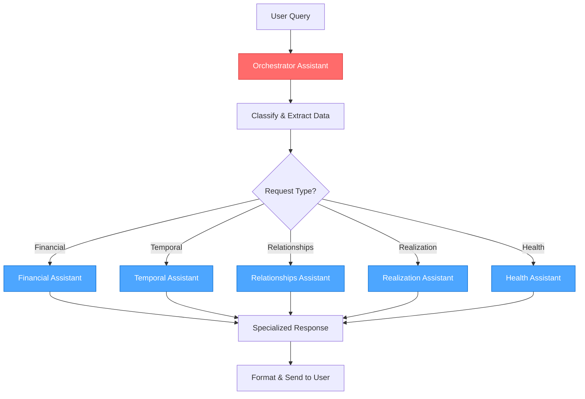
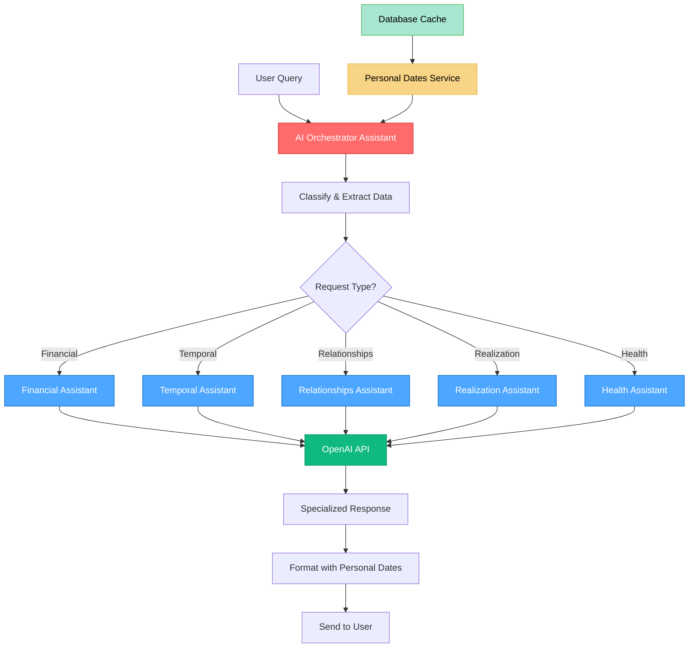

# 🎨 CREATIVE PHASE: Technical Specification v2 Design

## AI ORCHESTRATOR ARCHITECTURE

### Проблема
Создание системы специализированных AI ассистентов для классификации и обработки 5 типов запросов пользователей.

### Решение
**AI Оркестратор + Специализированные ассистенты** с отдельными ID и промптами.

### Архитектура
```python
class AIAssistantManager:
    def __init__(self):
        self.assistants = {
            'orchestrator': {
                'id': 'asst_orchestrator_001',
                'name': 'Request Classifier & Orchestrator',
                'purpose': 'Classify requests and extract context'
            },
            'financial': {
                'id': 'asst_financial_001', 
                'name': 'Financial Analysis Assistant',
                'purpose': 'Financial and career advice'
            },
            'temporal': {
                'id': 'asst_temporal_001',
                'name': 'Temporal Analysis Assistant', 
                'purpose': 'Time-based predictions and forecasts'
            },
            'relationships': {
                'id': 'asst_relationships_001',
                'name': 'Relationships Analysis Assistant',
                'purpose': 'Love, family, and compatibility analysis'
            },
            'realization': {
                'id': 'asst_realization_001',
                'name': 'Life Purpose Assistant',
                'purpose': 'Career path and life purpose guidance'
            },
            'health': {
                'id': 'asst_health_001',
                'name': 'Health & Energy Assistant',
                'purpose': 'Health advice and energy practices'
            }
        }
```

### Workflow обработки


### Ключевые особенности
- **Специализация:** Каждый ассистент решает свою задачу
- **Масштабируемость:** Легко добавлять новые типы запросов
- **Отладка:** Проще тестировать и улучшать каждый компонент
- **Производительность:** Параллельная обработка разных типов
- **Надежность:** Fallback между ассистентами

### Промпт для Оркестратора
```python
ORCHESTRATOR_SYSTEM_PROMPT = """
Ты - AI Оркестратор для системы цифровой психологии Миланы Тарба.

ТВОЯ ЗАДАЧА:
1. Классифицировать запрос пользователя по одному из 5 типов
2. Извлечь необходимые данные для анализа
3. Определить приоритет обработки

ТИПЫ ЗАПРОСОВ:

1. ФИНАНСОВЫЕ (financial):
   - Ключевые слова: деньги, заработать, доход, финансы, богатство, карьера, бизнес, работа
   - Данные: Матрица + ЧС + личный год + личный месяц + личный день
   - Фокус: Линии денег (1-4-7), энергии для заработка

2. ВРЕМЕННЫЕ (temporal):
   - Ключевые слова: когда, время, год, месяц, день, прогноз, предсказание, что ждет
   - Данные: личный год + личный месяц + личный день + матрица
   - Фокус: Временные периоды, прогнозы

3. ОТНОШЕНИЯ (relationships):
   - Ключевые слова: отношения, любовь, семья, брак, совместимость, партнер
   - Данные: Матрица + ЧС + ЧД + совместимость по ЧС
   - Фокус: Линии отношений (2-5-8, 3-6-9)

4. РЕАЛИЗАЦИЯ (realization):
   - Ключевые слова: реализация, предназначение, миссия, путь, карьера, профессия
   - Данные: Матрица + ЧС + ЧД + сфера деятельности
   - Фокус: Линии достижений, расчет сферы

5. ЗДОРОВЬЕ (health):
   - Ключевые слова: здоровье, энергия, болезни, самочувствие, практики
   - Данные: Матрица + ЧС + линии здоровья (1-2-3)
   - Фокус: Линии здоровья, рекомендации по практикам

ФОРМАТ ОТВЕТА (JSON):
{
  "request_type": "financial|temporal|relationships|realization|health",
  "confidence": 0.95,
  "extracted_data": {
    "birth_date": "1990-05-15",
    "current_date": "2024-12-19",
    "personal_year": 7,
    "personal_month": 3,
    "personal_day": 1
  },
  "context": "Краткое описание контекста запроса",
  "priority": "high|medium|low"
}

ВАЖНО: Всегда отвечай в формате JSON, без дополнительного текста.
"""
```

### Реализация RequestOrchestrator
```python
class RequestOrchestrator:
    def __init__(self, openai_client):
        self.client = openai_client
        self.orchestrator_id = "asst_orchestrator_001"
        
    async def classify_request(self, user_query: str, user_data: dict) -> dict:
        """Классификация запроса и извлечение данных"""
        
        prompt = f"""
        Запрос пользователя: {user_query}
        
        Данные пользователя:
        - Дата рождения: {user_data.get('birth_date')}
        - Текущая дата: {datetime.now().strftime('%Y-%m-%d')}
        - Матрица: {user_data.get('matrix')}
        - ЧС: {user_data.get('chs')}
        - ЧД: {user_data.get('chd')}
        
        Классифицируй запрос и извлеки необходимые данные.
        """
        
        response = await self.client.beta.threads.runs.create(
            thread_id=user_data['thread_id'],
            assistant_id=self.orchestrator_id,
            additional_instructions=prompt
        )
        
        return self._parse_orchestrator_response(response)
    
    def _parse_orchestrator_response(self, response) -> dict:
        """Парсинг ответа оркестратора"""
        try:
            return json.loads(response.choices[0].message.content)
        except json.JSONDecodeError:
            # Fallback на базовую классификацию
            return self._fallback_classification()
```

### Создание ассистентов через API
```python
async def create_orchestrator_assistant():
    """Создание оркестратора через OpenAI API"""
    
    assistant = await openai_client.beta.assistants.create(
        name="Request Classifier & Orchestrator",
        instructions=ORCHESTRATOR_SYSTEM_PROMPT,
        model="gpt-4-turbo-preview",
        tools=[{"type": "code_interpreter"}],
        metadata={
            "purpose": "request_classification",
            "version": "1.0",
            "created_by": "milana_tarba_system"
        }
    )
    
    return assistant.id

async def create_specialized_assistants():
    """Создание специализированных ассистентов"""
    
    assistants = {}
    
    for assistant_type, config in AI_ASSISTANT_CONFIGS.items():
        assistant = await openai_client.beta.assistants.create(
            name=config['name'],
            instructions=config['system_prompt'],
            model="gpt-4-turbo-preview",
            tools=[{"type": "code_interpreter"}],
            metadata={
                "purpose": assistant_type,
                "version": "1.0",
                "created_by": "milana_tarba_system"
            }
        )
        
        assistants[assistant_type] = assistant.id
    
    return assistants
```

## DATABASE SCHEMA DESIGN

### Проблема
Расширение схемы базы данных для поддержки личных дат и кэширования.

### Решение
**Гибридный подход с кэшированием** - основные поля в users + отдельная таблица для кэша.

### Схема
```python
class User(SQLModel, table=True):
    # Существующие поля...
    personal_year: Optional[int] = None
    personal_month: Optional[int] = None
    personal_day: Optional[int] = None
    last_calculation_date: Optional[date] = None

class PersonalDatesCache(SQLModel, table=True):
    id: Optional[int] = Field(default=None, primary_key=True)
    user_id: int = Field(foreign_key="user.id")
    calculation_date: date
    personal_year: int
    personal_month: int
    personal_day: int
    created_at: datetime = Field(default_factory=datetime.utcnow)
```

### Ключевые особенности
- Производительность через кэширование
- Гибкость для расширения
- Совместимость с существующим кодом
- История изменений

## UX/UI DESIGN

### Проблема
Улучшение пользовательского интерфейса для новых функций.

### Решение
**Поэтапное улучшение с новыми элементами** - добавление новых элементов с сохранением существующей структуры.

### Новые элементы
- **Личные даты:** Отображение в заголовке ответа
- **Тип запроса:** Индикатор типа в начале ответа
- **Контекстные данные:** Структурированное отображение

### Форматирование
```python
def format_response_with_personal_dates(user_data, response_type, ai_response):
    return f"""
🌟 **Личные даты:** {user_data.personal_year}/{user_data.personal_month}/{user_data.personal_day}
📊 **Тип запроса:** {response_type}
    
{ai_response}
    
💡 **Контекст:** Матрица {user_data.matrix}, ЧС {user_data.chs}, ЧД {user_data.chd}
"""
```

### Ключевые особенности
- Совместимость с существующим UX
- Поддержка всех новых возможностей
- Постепенное внедрение изменений
- Минимальная дезориентация пользователей

## РЕАЛИЗАЦИОННЫЕ РЕШЕНИЯ

### 1. AI Оркестратор
- **Классификация запросов:** Специализированный AI ассистент для определения типа
- **Извлечение данных:** Автоматическое извлечение контекстных данных
- **Маршрутизация:** Направление к соответствующему специализированному ассистенту
- **Fallback:** Резервная классификация при ошибках

### 2. Специализированные ассистенты
- **Отдельные ID:** Каждый ассистент имеет уникальный идентификатор
- **Специализированные промпты:** Оптимизированные для конкретного типа запросов
- **Независимое развитие:** Возможность улучшения каждого ассистента отдельно
- **Мониторинг:** Отслеживание производительности каждого компонента

### 3. Расчет личных дат
- **Кэширование расчетов:** Сохранение результатов на день
- **Автоматическое обновление:** Пересчет при изменении даты
- **Валидация данных:** Проверка корректности входных данных
- **Интеграция с оркестратором:** Передача данных в контексте

### 4. Производительность и надежность
- **Параллельная обработка:** Одновременная работа нескольких ассистентов
- **Кэширование:** Сохранение часто используемых данных
- **Асинхронность:** Неблокирующая обработка запросов
- **Обработка ошибок:** Graceful fallback между ассистентами

## СЛЕДУЮЩИЕ ШАГИ

1. **Создание AI ассистентов через OpenAI API**
   - Оркестратор для классификации запросов
   - 5 специализированных ассистентов для типов запросов
   - Настройка метаданных и инструментов

2. **Реализация RequestOrchestrator класса**
   - Классификация и извлечение данных
   - Парсинг JSON ответов
   - Fallback механизмы

3. **Обновление схемы базы данных**
   - Добавление полей личных дат в User
   - Создание таблицы PersonalDatesCache
   - Миграции для существующих данных

4. **Создание сервиса личных дат**
   - Расчет личных дат (год/месяц/день)
   - Кэширование результатов
   - Интеграция с оркестратором

5. **Обновление пользовательского интерфейса**
   - Отображение личных дат
   - Индикаторы типов запросов
   - Улучшенное форматирование ответов

6. **Интеграция и тестирование**
   - Интеграция всех компонентов
   - Тестирование workflow
   - Оптимизация производительности

## ВИЗУАЛИЗАЦИЯ АРХИТЕКТУРЫ


